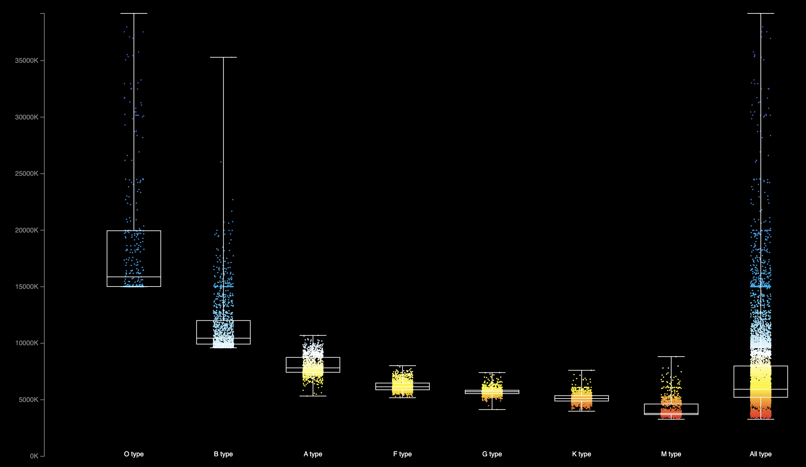
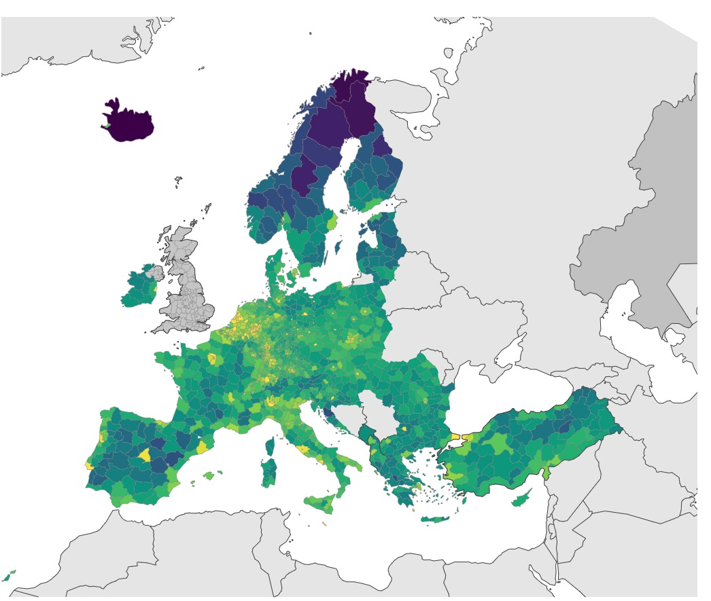

# Data Visualization D3 Projects

This repository showcases projects completed as part of the **CSC_51052_EP - Data Visualization** course at École Polytechnique. The projects focus on data visualization using **D3.js** and include various interactive graphics, animations, and visual representations of data. Each project is accompanied by images or GIFs that illustrate the results.

## Projects

### 1. Project 1: [Star temperature visualization according to types]
   - **Description**: Visualization the distribution of estimated star temperature from [Gaia DR3](https://www.cosmos.esa.int/web/gaia/dr3), broken down by spectral type. 
   - **Features**:
     - A multi-stop linear color gradient
     - Box plot figuring median, interquartile range, 1st and 3rd quartile, min/max
   -   

### 2. Project 2: [City temperature time series visualization animation]
   - **Description**: Visualization of temperature variations in a set of US cities, from 1948 to 2022, using monthly averages. 
   - **Features**:
     - Two mapping strategies: temperature to y-position or temperature to color
     - Animation switching between
   - 

### 3. Project 3: [Project Name]
   - **Description**: Visualization of population density by [NUTS region](https://ec.europa.eu/eurostat/web/nuts/background)
   - **Features**:
     - Visualization of NUTS regions
     - Coloring NUTS3 regions according to population density 
   -   

## Getting Started

1. Clone this repository:
   ```bash
   git clone https://github.com/yourusername/Data_Visualization_D3_Projects.git
   cd Data_Visualization_D3_Projects
